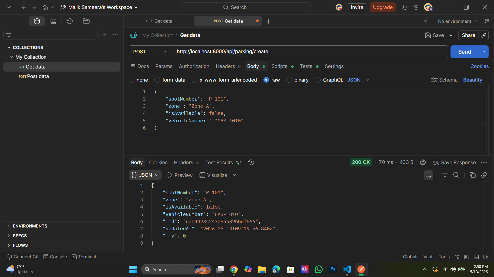
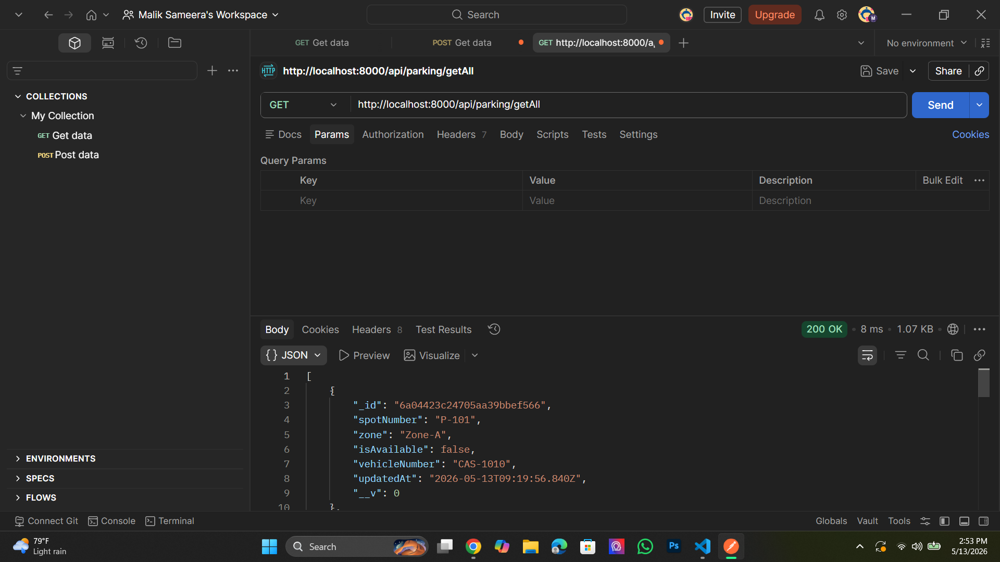
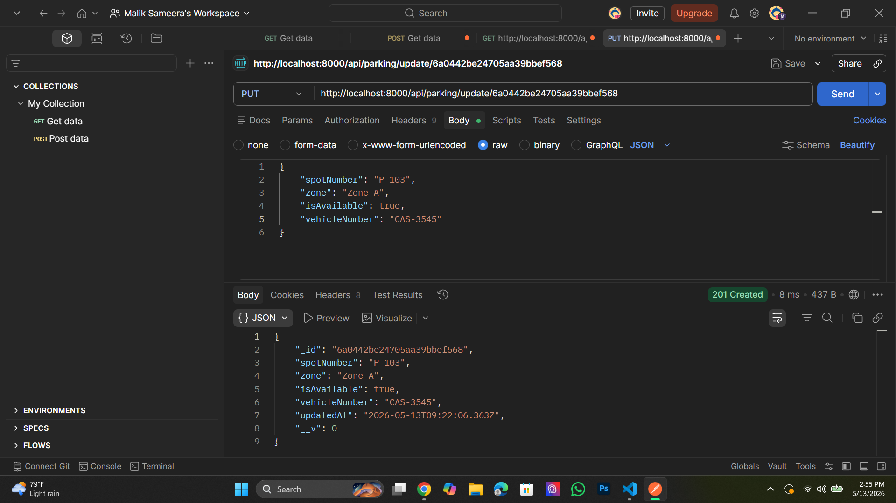
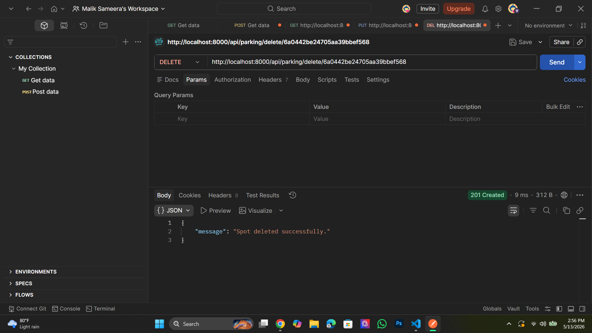

-Parking Spot Management System

A robust backend solution for managing parking availability in real-time. Built using Node.js, Express, and MongoDB, this system streamlines vehicle tracking and parking zone management.

-Project Overview
Finding a parking spot in busy areas is a challenge. This system provides a digital map of parking zones, allowing administrators to monitor which spots are vacant and which are occupied by specific vehicles.

-Tech Stack
* Backend: Node.js, Express.js
* Database: MongoDB
* API Testing: Postman
* Environment: Dotenv for secure configuration
* Middleware: CORS & Body-Parser

-Key Features
* Spot Allocation: Register parking spots within specific zones (e.g., Zone-A, Zone-B).
* Live Status Updates: Real-time tracking of `isAvailable` status.
* Vehicle Mapping: Link specific vehicle numbers to parking spots.
* Full CRUD Support: Endpoints for adding, viewing, updating, and removing parking data.

-API Testing Screenshots

1. Registering a New Parking Spot (POST)
Successfully added a new parking spot record with zone and vehicle details.

2. Fetching All Parking Data (GET)
Retrieving the complete list of parking spots from the cloud database.

3. Updating Spot Status (PUT)
Updating the availability status when a vehicle enters or leaves the spot.

4. Removing a Record (DELETE)
Deleting a parking spot record from the system.

